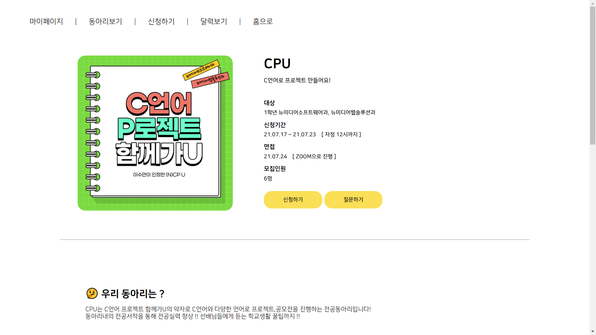
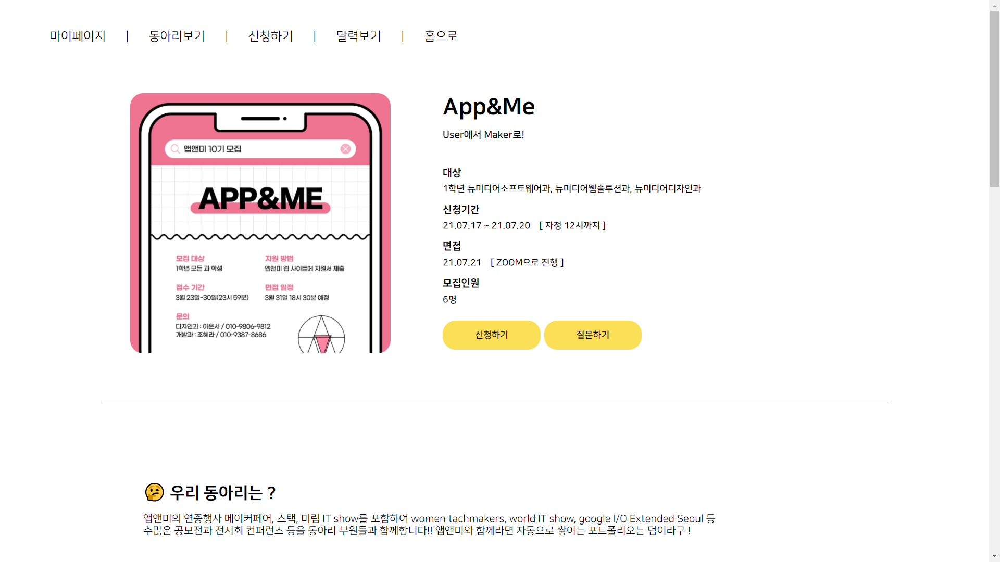

### 동스청

미림여자정보과학고등학교의 전공동아리 홍보 및 지원사이트입니다.

#### Website

### 호스팅 주소
http://dongschung.dothome.co.kr/

### Features

* About
    * 미림여자정보고학고등학교의 전공동아리의 간단한 소개를 제공합니다.
* 지원하기
    * 앱앤미에 지원하려는 신입생들의 온라인 신청을 받고 있습니다. 
* 관리자기능
    * 각 동아리의 짱들은 관리자 로그인을 하여 자신의 동아리 지원자를 확인할 수 있습니다.

### 실행 화면

> 
**메인화면**

> 
**동아리 소개페이지 (1)**

> 

### Built With

* [dothome](https://www.dothome.co.kr/) - Server Hosting
* [PHP](https://www.php.net/) - Back-end Development
* HTML/CSS/JavaScript - Front-end Development
* [MySQL](https://www.mysql.com/) - Database
* [phpmyadmin](https://www.phpmyadmin.net/) - MySQL Hosting

### Authors

* **조해정** - *Full-stack Development* - [haezzang](https://github.com/haezzang)
* **조혜라** - *Back-end Development* - [areyh817](https://github.com/areyh817)
